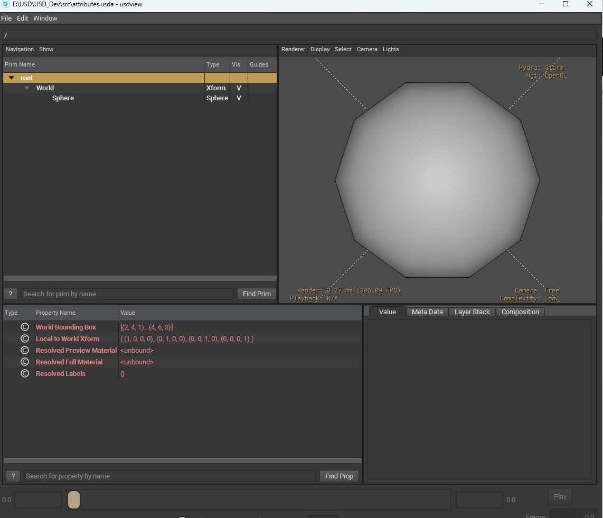

# USD DEV

This branch focuses on building a solid foundation for **OpenUSD development**, with an emphasis on clean, structured, and reusable Python workflows.

It serves as a central workspace for experimenting with USD, learning its core concepts, and gradually developing the tools and practices needed for a scalable USD-based pipeline.

## Installing usdview and Setting Up Python

Before working with the examples in this branch, you'll need to install **OpenUSD** and configure `usdview`.

`usdview` is the official USD scene viewer and provides a convenient way to inspect USD stages, prims, attributes, relationships, and scene composition.

OpenUSD supports Linux, macOS, and Windows. The setup instructions in this branch are primarily focused on **Windows**. On macOS, `usdview` may need to be built from the OpenUSD source repository.

## Running usdview

After building and installing [OpenUSD](https://github.com/PixarAnimationStudios/OpenUSD), configure the required environment variables in your terminal.

> **Note:** Replace the paths below with the paths where you installed OpenUSD on your system.

```bat
set PATH=E:\USD\USD_Install\bin;E:\USD\USD_Install\lib;%PATH%

set PYTHONPATH=E:\USD\USD_Install\Lib\site-packages;%PYTHONPATH%
```

You can then open a USD file with:

```bat
usdview "E:\USD\OpenUSD_BHM\pxr\assets\HelloWorld.usda"
```

Replace the USD file path above with the location of your own `.usda` file.


